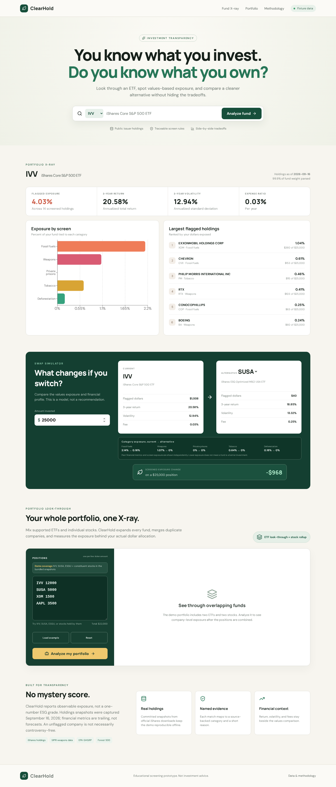

# ClearHold

> You know what you invest. Do you know what you own?

ClearHold is an investment-transparency app that looks through an ETF, shows its exposure to user-readable values screens, names the companies behind the numbers, and compares a screened alternative without hiding financial tradeoffs.



**Live demo:** deployment-ready for Render. The public link will be added here after the owner creates the service and the URL is verified.

## Features

- **ETF look-through:** parses official issuer holdings snapshots for IVV, SUSA, and ESGU.
- **Custom portfolio X-ray:** accepts a mix of ETF and stock positions, expands funds, merges overlapping companies, and reports dollar-weighted exposure with clear coverage and unknown-ticker handling.
- **Explainable screens:** reports exposure to fossil fuels, weapons, tobacco, deforestation risk, and private-prison operators using explicit company-level rules.
- **Named holdings:** shows which companies drove a result and how much of the fund each represents.
- **Financial context:** keeps three-year annualized return, three-year volatility, and expense ratio beside the values comparison.
- **Swap simulator:** shows category-by-category exposure, trailing return, volatility, fees, and hypothetical dollar impact before and after, without labeling an alternative as inherently better.
- **Calculation trail:** drills from each input position through ETF weight to underlying-company dollars, portfolio percentage, category, and classification source.
- **Offline and reproducible:** committed source fixtures keep demos and tests independent of network access.

## How it works

1. The Express API reads a selected fund's committed iShares CSV.
2. `Papa Parse` normalizes the equity holdings and weights.
3. An explicit, source-noted company map applies one or more values categories.
4. The analyzer aggregates category and overall flagged exposure.
5. React renders the fund X-ray, largest matches, and an alternative comparison.

This is an educational screening prototype, not an ESG rating or investment recommendation. An unflagged company may still have material issues outside the curated rules.

## Data sources

Every input and caveat is documented in [DATA_SOURCES.md](DATA_SOURCES.md). The principal sources are official [iShares fund pages](https://www.ishares.com/us), the [EPA GHGRP](https://www.epa.gov/ghgreporting), [SIPRI Arms Industry Database](https://www.sipri.org/databases/armsindustry), [WHO](https://www.who.int/en/news-room/fact-sheets/detail/tobacco/), and [Forest 500](https://forest500.org/forest-500-data-methods/).

## Tech stack

- TypeScript
- React 19 + Vite
- Node.js + Express
- Recharts
- Vitest + Testing Library
- Playwright

## Project structure

```text
src/                         React interface and API client
server/
  analyze.ts                 CSV parsing, screening, aggregation, simulation
  index.ts                   Express API
  data/                      Fund metadata, screen rules, issuer CSV fixtures
tests/
  analyze.test.ts            Analysis and simulation tests
  app.test.tsx               Component test
  e2e/app.spec.ts            Browser workflow and visual regression test
public/screenshots/          Verified app screenshot
DATA_SOURCES.md              Sources, definitions, and limitations
```

## Running locally

Requires Node.js 20 or newer.

```bash
npm install
npm run dev
```

Open `http://localhost:5173`. The API runs on `http://localhost:8787` and Vite proxies `/api` requests during development.

For a production build:

```bash
npm run build
NODE_ENV=production npm start
```

## Testing

```bash
npm test             # unit and component tests
npm run test:e2e     # Chromium workflow + screenshot regression
npm run build        # strict TypeScript check + production bundle
```

Verified September 18, 2026: **18 unit/component tests and 4 Playwright tests pass**, and the production build completes. The screenshot above was captured by the passing Playwright flow at a 1440px desktop viewport and visually inspected for readability, spacing, clipping, and hierarchy.

## Deployment

`render.yaml` defines one Render web service for the existing Express app. It runs `npm ci && npm run build`, serves the Vite bundle from Express, checks `/api/health`, and needs no secrets. After the repository is pushed, import the Blueprint in Render and verify the generated public URL before replacing the placeholder live-demo link above.

## Honest limitations

- The app resolves three curated U.S. equity ETFs plus individual stocks present in those snapshots. Other tickers are reported and excluded rather than guessed; there is no connected brokerage import.
- Screen coverage is deliberately small and explainable. It is not a complete controversy database.
- Metrics and holdings are dated snapshots. They are not live prices or forecasts.
- Similar past return and volatility do not make two funds economically equivalent.
- No personal tax, liquidity, suitability, or transaction-cost analysis is performed.

## Disclaimer

For educational use only. ClearHold does not provide investment, legal, or tax advice. Past performance does not predict future results.
